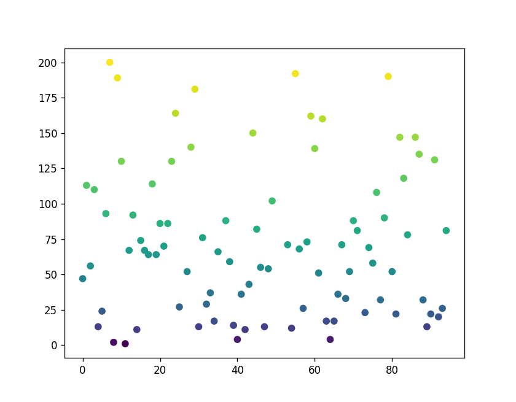
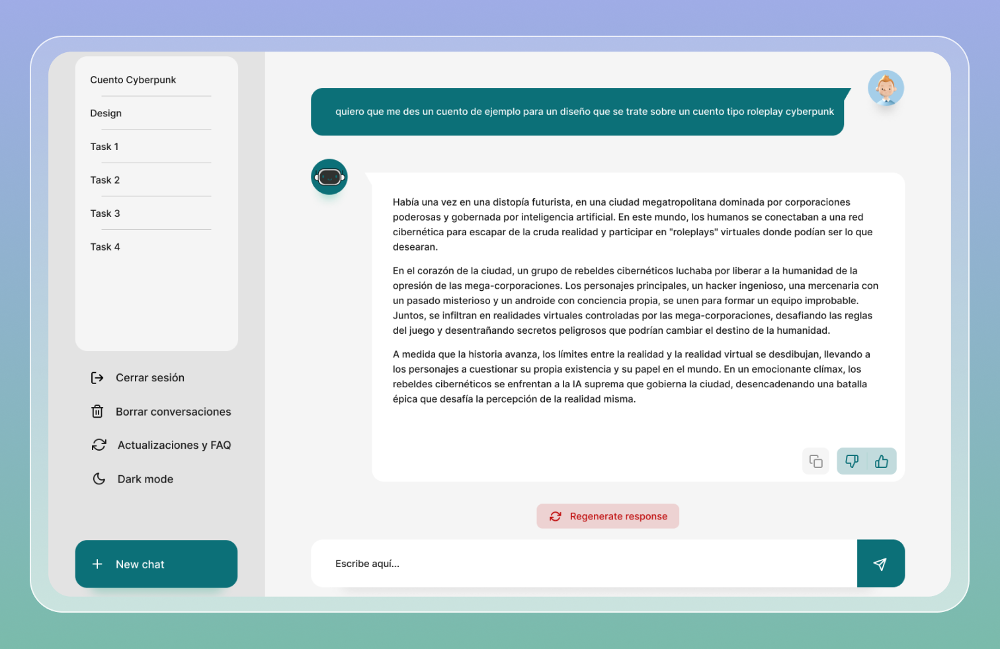

# Technical-Interview
Lista de ejercios a Resolver 
### Recomendacion leer Matplolib
-----
> Note: no usar ia ( sabemos que el dia a dia de un programador la usamos pero esta vez necesitamos ver su razonamiento).

> P.D: Igualmente lo notaremos. 

1 - [Manipulacion de datos](1_prueba.py)
## Problemática:
 * Completar codigo que lea un  archivo JSON, los lee y los manipula de varias maneras, y finalmente visualiza los datos en un gráfico de dispersión

> P.D Toca en aqui para ver el codigo completo [Manipulacion de datos](1_prueba.py)
## Instrucciones

> Este código en Python carga datos de un archivo JSON (data.json ), los ordena, filtra y genera una gráfica de dispersión. La opacidad de los puntos en la gráfica se determina por el valor de 'tipo', que se calcula a partir del valor de 'z' en los datos
>
## Resultado Esperado

---
2 - [Logica]()
## Problemática:
 * Graficar con un scatter de matplotlib la expresión matemática x elevado a x (x^x) con 100 números entre 0 y 1, el gráfico resultante debe ser igual a la siguiente imagen
 
## Instrucciones 
> Que puede usar las librerias que te salgan del cora 💌 suerte 🍀
>

## Resultado Esperado

---
 3- [Lógica y transformación de datos](4_excercise.py)

## Problemática:
* El dueño de un parque contrató a una empresa para registrar la temperatura de diversos lugares, la empresa contaba con un termómetro que registraba los datos en centígrados y otro que registraba los datos en fahrenheit, lo unió todo y entregó los resultados juntos. Te contrato para que grafiques los datos en centigrados dentro de un mapa de scatter.

## Instrucciones: 
>Tienes una clase llamada Ponquesito dentro del archivo modulo.py, debes seguir las instrucciones dentro del archivo y transformar la data que se encuentra en el codigo para poder usar la clase Ponquesito, ya esta listo el codigo que realiza el grafico. No se puede modificar la clase Ponquesito.

## Resultado Esperado

---
4 -[Optimizacion y mejora](modulo.py)
 ## Instrucciones:
>Entra a la clase Ponquesito y explica que mejoras y correcciones podrias hacerle al codigo y resuelve la problematica con tu nueva clase mejorada.

5 - Prueba Tecnica de UI vue 2 o vue 3 o React ( Solo si eres Frontend)

## Importante Resultados del codigo Enviar a este correo: daniel.silva@ea2technology.com Si tienes algun Duda puedes contantarte a este correo suerte 🍀
