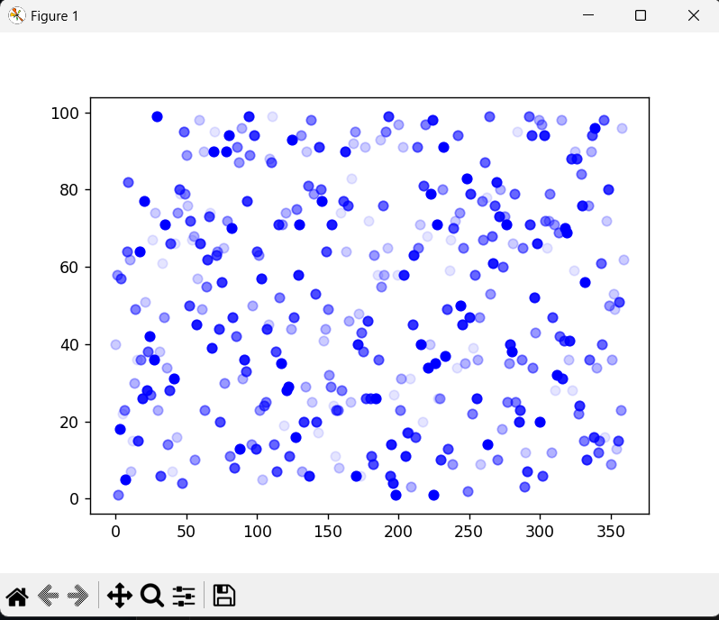
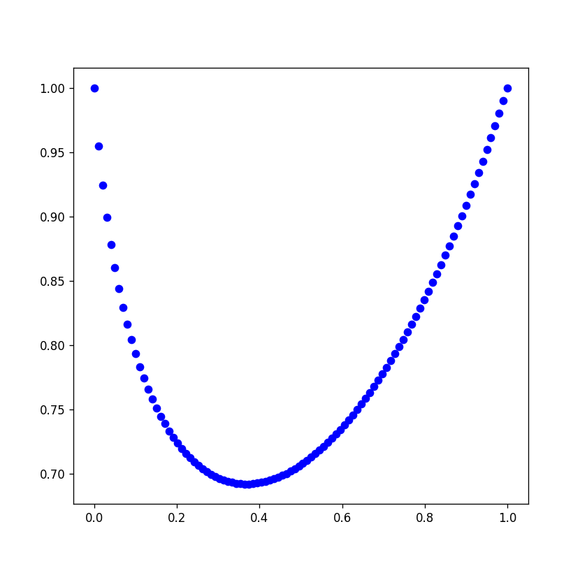

# Technical-Interview
Lista de ejercios a Resolver 
### Recomendacion leer Matplolib
-----
> Note: no usar ia ( sabemos que el dia a dia de un programador la usamos pero esta vez necesitamos ver su razonamiento).

> P.D: Igualmente lo notaremos. 

1 - [Manipulacion de datos]
 * Completar codigo que lea un  archivo JSON, los lee y los manipula de varias maneras, y finalmente visualiza los datos en un gráfico de dispersión

> P.D Toca en aqui para ver el codigo completo [Manipulacion de datos](1_prueba.py)
## Instrucciones

> Lee los datos desordenados del archivo 'data.json' y los ordena por el valor de 'x' en orden descendente e Itera sobre los elementos de MODULES, filtra los datos y genera > una gráfica de dispersión de los datos filtrados. La opacidad del color de los puntos en la gráfica de dispersión se determina por el valor de 'type'.
>
## Resultado Esperado

---
2 - [Logica]
 * Graficar con un scatter de matplotlib la expresión matemática x elevado a x (x^x) con 100 números entre 0 y 1, el gráfico resultante debe ser igual a la siguiente imagen
 
## Instrucciones 
> Que puede usar las librerias que te salgan del cora 💌 suerte 🍀
>

## Resultado Esperado

